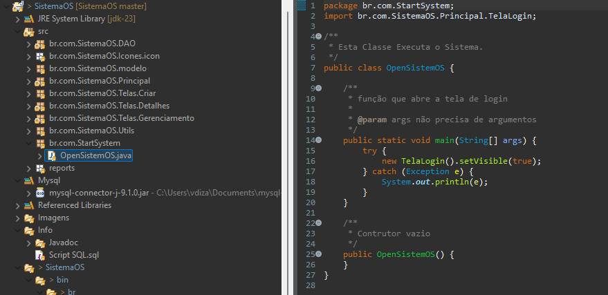

# Sistema de Ordem de Serviço

Este projeto tem como objetivo aprender e praticar os conceitos básicos de **JFrame** e **SQL**. Foi desenvolvido com ferramentas básicas, sem o uso de frameworks avançados, para proporcionar uma experiência prática de como funciona o desenvolvimento de aplicações com interface gráfica e banco de dados.

## Objetivo

O projeto visa aprender e praticar conceitos básicos de JFrame para criação de interfaces gráficas e SQL para interação com banco de dados, através da implementação de um Sistema de Ordem de Serviço. A ideia é explorar como essas tecnologias podem ser combinadas para desenvolver uma aplicação prática que facilite a gestão de ordens de serviço, clientes e usuários.

- **JFrame** para criar interfaces gráficas simples.
- **SQL** para interação com banco de dados, realizando operações como inserção, atualização, consulta e exclusão de dados.

## Funcionalidades

Atualmente, o sistema oferece as seguintes funcionalidades:

### CRUD Usuários
Permite ao Administrador e aos usuários com a permissão "Admin" criar, editar, deletar e visualizar usuários cadastrados no sistema.

### CRUD Clientes
Funcionalidade semelhante à de usuários, permitindo a gestão completa dos clientes.

### Validações
O sistema possui validações robustas para evitar erros e garantir uma experiência segura e eficiente.

### Geração de Relatórios
Agora é possível gerar relatórios detalhados de clientes, serviços e usuários, facilitando o controle e a gestão.

### Formatação de Números e Preços
Os valores financeiros e numéricos são formatados corretamente para melhor visualização.

### Tela Principal Ajustada
A interface da tela principal foi melhorada para proporcionar uma navegação mais intuitiva e eficiente.

## Status do Projeto

Atualmente, o sistema está em fase de desenvolvimento. Estou criando as funcionalidades de **Clientes** e pretendo gerar um **arquivo executável** para facilitar os testes e a execução do sistema sem a necessidade de IDE.

## Tecnologias Utilizadas

- **Java** (JDK 23): Linguagem de programação principal.
- **JFrame**: Biblioteca para criação de interfaces gráficas em Java.
- **MySQL**: Sistema de gerenciamento de banco de dados relacional.
- **Ireport-5.6.0**: Ferramenta para geração de relatórios.

## Avisos

Para executar o projeto na sua IDE, você precisa usar o JDK 23. Caso não tenha, você pode baixá-lo por este link:

[JDK23](https://www.oracle.com/java/technologies/downloads/#jdk23-windows)

Verifique se você possui o WindowBuilder. Caso não tenha, siga estes passos:

1. **NO ECLIPSE**: No painel principal, vá em "Help -> Install New Software".
2. Clique em "Work with" e cole o seguinte link:
   
    ```Link
    WindowBuilder Latest Nightly - https://download.eclipse.org/windowbuilder/lastgoodbuild/
    ```
    
4. Selecione o WindowBuilder e clique em "Finish".

Caso precise do Ireport, você pode baixá-lo por aqui: [Ireport]([https://www.oracle.com/java/technologies/downloads/#jdk23-windows](https://sourceforge.net/projects/erpbarcode/files/JasperSoft/iReport-5.6.0-windows-installer.exe/download))

Para executar o Ireport, você precisa do Java 7, que pode ser baixado aqui: [Java 7](https://www.oracle.com/java/technologies/javase/javase7-archive-downloads.html)

  Para executar o Ireport com o Java 7, abra o bloco de notas como administrador e vá no local de instalação do Ireport: iReport-5.6.0\etc\ireport.conf e abra o arquivo. Na parte:

  #default location of JDK/JRE, can be overridden by using --jdkhome <dir> switch
  #jdkhome="/path/to/jdk"
  
  Logo abaixo, adicione a linha:
  
  jdkhome="C:\Program Files\Java\jdk1.7.0_80"

Para que sua IDE abra execute o modo de Impressão você deve adicionar 2 argumentos na hora de executar:

1. vá em window->Preference->Installed JREs
   
3. selecione o jdk e clique em "Edit"
   
5. Adicione os seguintes Argumentos em Default VM arguments:
   
   ```Argumentos
   --add-opens Java.base/Java.lang=ALL-UNNAMED
   --add-opens Java.base/Java.util=ALL-UNNAMED
   ```
   
7. Clique em "Finish"
   
 ## Como Executar

 1. Clone o repositório para o seu computador:
    ```bash
      git clone [https://github.com/ViniciusDizatnikis/SistemaOS.git](https://github.com/ViniciusDizatnikis/SistemaOS.git)
    ```
 2. Configure seu banco de dados com a estrutura abaixo para que funcione corretamente.

 ```sql
 -- Criar o banco de dados
 CREATE DATABASE sistemaOS;
 USE sistemaOS;

 -- Tabela de usuários
 CREATE TABLE usuarios (
     iduser INT PRIMARY KEY AUTO_INCREMENT,
     usuario VARCHAR(50) NOT NULL,
     fone VARCHAR(15),
     login VARCHAR(15) NOT NULL UNIQUE,
     senha VARCHAR(15) NOT NULL,
     perfil VARCHAR(20) NOT NULL 
 );

 -- Inserir usuários
 INSERT INTO usuarios(usuario, fone, login, senha, perfil) VALUES 
 ('Administrador', '41 99999-9999', 'admin', 'admin', 'admin');

 -- Tabela de clientes
 CREATE TABLE clientes (
     idcliente INT PRIMARY KEY AUTO_INCREMENT,
     nome VARCHAR(50) NOT NULL,
     endereco VARCHAR(100),
     fone VARCHAR(50) NOT NULL,
     email VARCHAR(50)
 );

 -- Tabela de ordens de serviço
 CREATE TABLE tbos (
     os INT PRIMARY KEY AUTO_INCREMENT,
     data_os TIMESTAMP DEFAULT CURRENT_TIMESTAMP,
     equipamento VARCHAR(150) NOT NULL,
     defeito VARCHAR(150) NOT NULL,
     servico VARCHAR(150),
     tecnico VARCHAR(30),
     valor DECIMAL(10, 2),
     idcliente INT NOT NULL,
     iduser INT NOT NULL,
     FOREIGN KEY (idcliente) REFERENCES clientes(idcliente),
     FOREIGN KEY (iduser) REFERENCES usuarios(iduser)
 );
 ```
3. Configure a conexão com seu banco de dados SQL em "ModuloDeConexao.java"

     


4. Abra sua IDE com o projeto e procure por "br.com.StartSystem/OpenSistemOS.java" e a execute, é por ela onde começa todo o sistema.

   

5. Se seu banco de dados estiver configurado corretamente aparecerá esta tela:

   
   
use essas credenciais para logar:
- **Login**: "admin"
- **Senha**: "admin"

6. Ele abrirá a tela principal do sitema. 
  

## Javadoc

O projeto conta com documentação Javadoc detalhada, disponível em Info/javadoc, que descreve todas as classes e métodos implementados, facilitando a compreensão e manutenção do código.

Este projeto ainda está em desenvolvimento. Se encontrar algum problema, sinta-se à vontade para abrir uma issue no repositório do GitHub.

## Conclusão

Este projeto é uma excelente oportunidade para aprender e praticar conceitos básicos de desenvolvimento de software com Java, JFrame e SQL. Sinta-se à vontade para contribuir, 
testar e reportar quaisquer problemas encontrados. Sua contribuição é muito bem-vinda!
