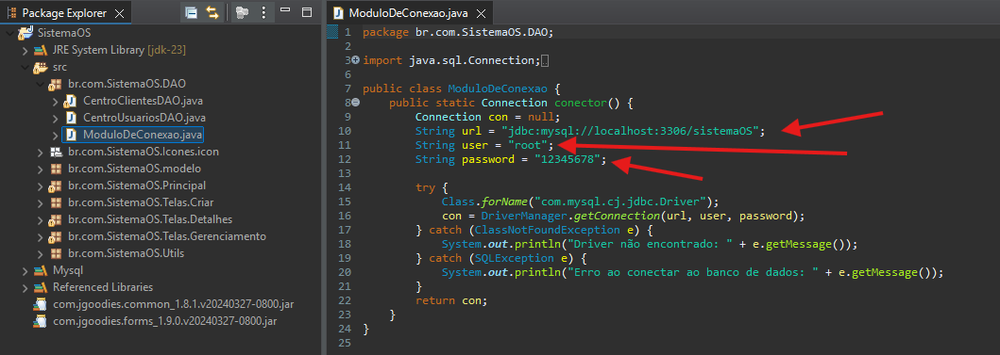
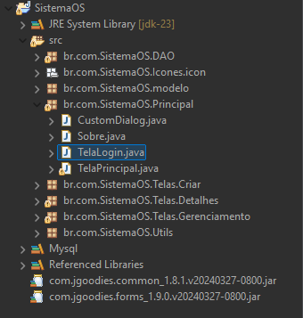
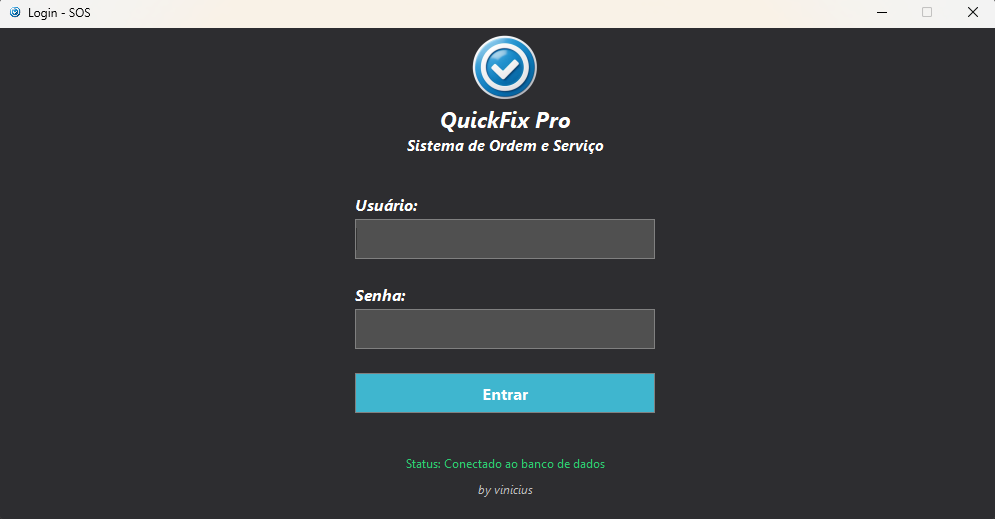
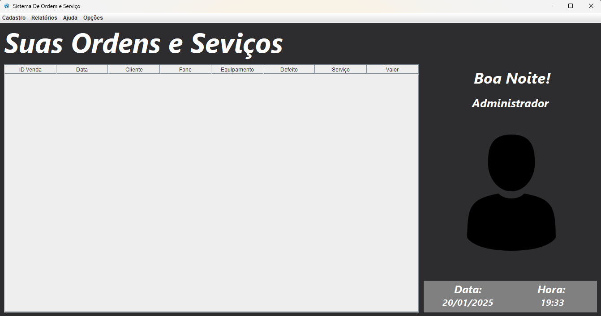

# Sistema de Ordem de Serviço

 Este projeto tem como objetivo aprender e praticar os conceitos básicos de **JFrame** e **SQL**. Foi desenvolvido com ferramentas básicas, sem o uso de frameworks avançados, para proporcionar uma experiência prática de como funciona o desenvolvimento de aplicações com interface gráfica e banco de dados.

 ## Objetivo

 Explorar e entender os conceitos fundamentais do desenvolvimento de sistemas utilizando:

 - **JFrame** para criar interfaces gráficas simples.
 - **SQL** para interação com banco de dados, realizando operações como inserção, atualização, consulta e exclusão de dados.

 ## Funcionalidades

 Atualmente, o sistema oferece as seguintes funcionalidades:

 - **CRUD de Usuário**: Permite ao Administrador criar novos Usuários com diferentes permissões (User, Admin).
 - **Consulta e Atualização**: Usuários com permissão de Admin podem verificar e criar novos usuários, mas não podem excluir ou modificar o Admin.
 - **Verificação de Usuários**: Contém validações para criar usuários sem erros no banco de dados.
 - **CRUD de Clientes**: Permite a conta com admin criar novos Clientes e podendo alterar e apagar quando quiser.

 ## Status do Projeto

 Atualmente, o sistema está em fase de desenvolvimento. Pretendo gerar um **arquivo executável** para facilitar os testes e a execução do sistema sem a necessidade de IDE.

 ## Tecnologias Utilizadas

 - **Java** (JDK) - Linguagem principal utilizada no desenvolvimento do sistema.
 - **JFrame** - Biblioteca para criação da interface gráfica.
 - **SQL** - Para a gestão de dados no banco de dados.

 ## Como Executar

## 1. Clone o repositório para o seu computador:
    ```bash
      git clone [https://github.com/ViniciusDizatnikis/SistemaOS.git](https://github.com/ViniciusDizatnikis/SistemaOS.git)
    ```
## 2. Configure seu banco de dados com a estrutura abaixo para que funcione corretamente.

# Código SQL para Banco de Dados

 Você pode copiar o código SQL abaixo para configurar o banco de dados:

 ```sql
 -- Criar o banco de dados
 CREATE DATABASE sistemaOS;
 USE sistemaOS;

 -- Tabela de usuários
 CREATE TABLE usuarios (
     iduser INT PRIMARY KEY AUTO_INCREMENT,
     usuario VARCHAR(50) NOT NULL,
     fone VARCHAR(15),
     login VARCHAR(15) NOT NULL UNIQUE,
     senha VARCHAR(15) NOT NULL,
     perfil VARCHAR(20) NOT NULL 
 );

 -- Inserir usuários
 INSERT INTO usuarios(usuario, fone, login, senha, perfil) VALUES 
 ('Administrador', '41 99999-9999', 'admin', 'admin', 'admin');

 -- Tabela de clientes
 CREATE TABLE clientes (
     idcliente INT PRIMARY KEY AUTO_INCREMENT,
     nome VARCHAR(50) NOT NULL,
     endereco VARCHAR(100),
     fone VARCHAR(50) NOT NULL,
     email VARCHAR(50)
 );

 -- Tabela de ordens de serviço
 CREATE TABLE tbos (
     os INT PRIMARY KEY AUTO_INCREMENT,
     data_os TIMESTAMP DEFAULT CURRENT_TIMESTAMP,
     equipamento VARCHAR(150) NOT NULL,
     defeito VARCHAR(150) NOT NULL,
     servico VARCHAR(150),
     tecnico VARCHAR(30),
     valor DECIMAL(10, 2),
     idcliente INT NOT NULL,
     iduser INT NOT NULL,
     FOREIGN KEY (idcliente) REFERENCES clientes(idcliente),
     FOREIGN KEY (iduser) REFERENCES usuarios(iduser)
 );
 ```
## 3. configure para seu banco de dados no "ModuloDeConexao.java"
  

## 4. vá ate o jFrame "TelaLogin.java" e execute o codigo.
  

## 5. logo apos ele irá abrir esta tela. 
  
Se seu banco de dados estiver correto basta colocar essas informções:
- **Login**: "admin"
- **Senha**: "admin"

# Tela Principal
  
Ele abrira a tela principal do sistema.

**Atenção:** Este código ainda está em desenvolvimento e pode conter alguns bugs.

